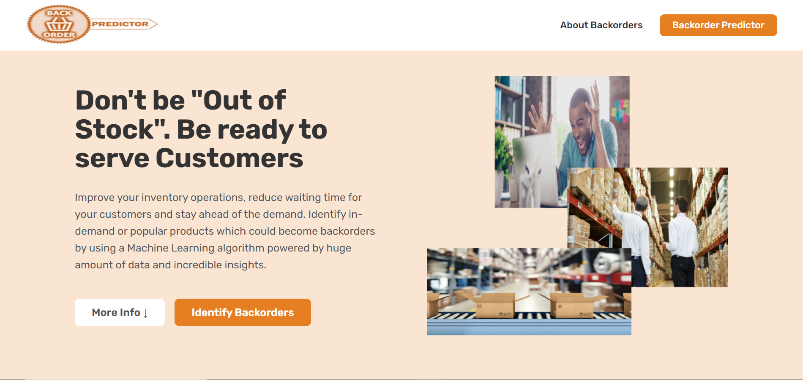

# Backorder-Predictor

An end-to-end E-Commerce backorder solution created as a part of the Data Science Project Internship with iNeuron.ai. 

## About the Topic - Backorders in E-commerce setup
A backorder is an item that is not in stock at the moment. The customer can still order it, but delivery will only happen once the stock has been replenished. This is different from a situation when a product is labeled as being “out-of-stock” on the web platform which means the customer can’t order the product. However, backorders can still be placed despite the product not being in stock at a given moment in time. However, this causes a lot of additional inventory costs and wait for the customers, which is undesirable.

## Objective
The aim is to create a prediction model largely to identify whether items could be going out of stock or on backorder. This will help us to keep adequate or surplus stock of those products in order to meet demands of customers and not lose sales opportunities.

## Tools and Key Skills involved
The project involved the use of the following - 
1. Python - Scripting language used for building the Machine Learning Classification Model.
2. AWS Sagemaker - IDE provided by Amazon Web Services to run python code.
3. HTML & CSS - Building a User-interface / website for the application for users
4. Flask - To contain the Machine Learning model and connect it with the front-end User-interface built.  
5. Heroku & Github - To deploy the application on the server.
6. AWS Ec2 - Online Solution Hosting service provided by Amazon Web Services to host the entire application in cloud.

## Description of the Project

### Machine Learning - 
In order to build the model for predicting which products would go into backorders, the following data science project steps were performed
1. Business Understanding - Comprehensive study of the E-commerce domain, meaning and significance of Backorders in E-commerce, features related to backorders and non backordered products like sales, forecasts, lead time, risks involved, etc present in dataset.

2. Data Understanding - Understanding the no. of records, independent variables (predictors) and dependent variable (predicted) in the dataset, checking balance or imbalance of target classes in dataset, datatypes of the features, etc.

3. Data Cleaning - Checking and removing any lead spaces in feature names, checking categories properly given, values, changing datatypes of features wherever appropriate, etc.

4. Exploratory Data Analysis - Performing univariate analysis to understand the distributions of numerical features & % representation of categories in categorical features, bi-variate analysis and statistical analysis to understand relationship between independent and dependent features & Multivariate analysis to check for multicollinearity, mapping dependent variable onto the relationship between 2 or more variables to understand importance of pairs of features in classification and removal of redundant features.

5. Data Preparation - Splitting data into train and test samples and performing missing value treatment, outlier treatment through appropriate means, encoding of categorical features, undersampling of majority class as per observation of ratio of majority to minority classes seen in EDA.

6. Model Building - Create Several baseline models like Logistic regression, KNN, Decision tree, Bagging and boosting classification algorithms. Checking performance of models using F1 score due to slight but reduced imbalance. Checking model stability using cross validation and also checking response time (latency) of each model in seconds.

7. Feature Selection - Using feature importances, backward feature elimination and recursive feature elimination to reduce no. of features to build a lesser complex model. Recall scores were given more importance due to business problem requirements and lower recalls during baseline model creation.

8. Hyperparameter tuning - Using Grid Search to find optimum parameter in order to try improve model performance.

### User Interface Creation - 
In order to build user interface to allow users to use the model on the web, HTML was used to create a webpage, involving a brief overview of backorders and a predictor form. To style the page, CSS was applied and additional animations like scrolling and floating navigation bar was added using Javascript.

### Deployment -
In order to deploy the application on the web, the files were pushed to github. An app for the project was build using Heroku. The app was connected to the github repository containing the files and the app was deployed.

### Hosting Solution on the cloud - 
In order to deploy the application on the web, AWS Ec2 instance was created usng Ubuntu as virtual machine. Also involved use of software like Putty, Puttygen and Winscp

## Link to Website - 
Click the following link to use app: 
### https://backorder-predictor.herokuapp.com/

